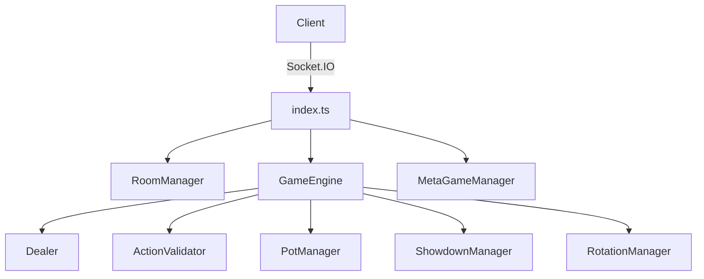

# Phase 3 学習ノート: ゲームエンジン完全実装

**日付**: 2026-01-14  
**所要時間**: 約30分

---

## 🎯 今日達成したこと

Phase 3全体（A/B/C/D）を完成させました。

---

## 📁 作成・編集したファイル

### サーバー側 (11ファイル)

| ファイル | 役割 |
|---------|------|
| `types.ts` | 型定義（Player, Room, ActionType等） |
| `RoomManager.ts` | 部屋の作成・参加・着席管理 |
| `Dealer.ts` | デッキ管理、カード配布、ブラインド徴収 |
| `GameEngine.ts` | FSM状態管理、ハンドループ制御 |
| `ActionValidator.ts` | プレイヤーアクション検証 |
| `PotManager.ts` | メインポット・サイドポット計算 |
| `ShowdownManager.ts` | ショーダウン時の勝者判定 |
| `gameVariants.ts` | 8種類のゲーム設定定義 |
| `RotationManager.ts` | ゲームローテーション管理 |
| `MetaGameManager.ts` | 7-2ゲーム、スタンドアップ |
| `index.ts` | Socket.IOイベント統合 |

### クライアント側 (3ファイル)

| ファイル | 役割 |
|---------|------|
| `App.tsx` | ルーティング（名前入力→ロビー→テーブル） |
| `Lobby.tsx` | 部屋一覧、部屋作成 |
| `Table.tsx` | ゲームUI、アクションボタン |

---

## 🎮 実装した機能

### Phase 3-A: ルーム管理
- 6桁の部屋ID生成
- Open卓/Private卓対応
- 6人テーブル着席システム
- リアルタイム状態同期

### Phase 3-B: ゲームループ
- FSM（有限状態マシン）
- PREFLOP→FLOP→TURN→RIVER→SHOWDOWN
- Fold/Check/Call/Bet/Raise/All-in
- ポット計算とサイドポット
- 30秒アクションタイムアウト

### Phase 3-C: ミックスゲーム
- 8種類のゲームバリアント
  - NLH, PLO, PLO8, 2-7TD, 7CS, 7CS8, RAZZ, BADUGI
- ローテーションプリセット
  - HORSE, 8-Game
- 6ハンドごとの自動切り替え

### Phase 3-D: 特殊ルール
- 7-2ゲームボーナス（BB×10）
- スタンドアップゲーム

---

## 🧪 検証結果

```
Phase 3-A: 10/10 合格 ✅
Phase 3-B:  3/3  合格 ✅
Phase 3-C:  3/3  合格 ✅
-----------------------
合計:      16/16 合格 ✅
```

---

## 🏗️ アーキテクチャ



---

## 💡 学んだこと

1. **TypeScriptの型安全性**
   - 複雑な状態管理でも型で守られる
   - インターフェースの継承で拡張性確保

2. **FSMパターン**
   - ゲームフェーズの明確な状態遷移
   - デバッグしやすい構造

3. **モジュール分割**
   - 単一責任原則でクラスを分離
   - 後からの機能追加が容易

---

## 🚀 次のステップ

- UI/UXの改善
- スタッド/ドローの詳細実装
- AWS本番デプロイ
